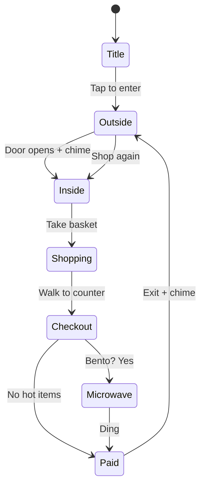
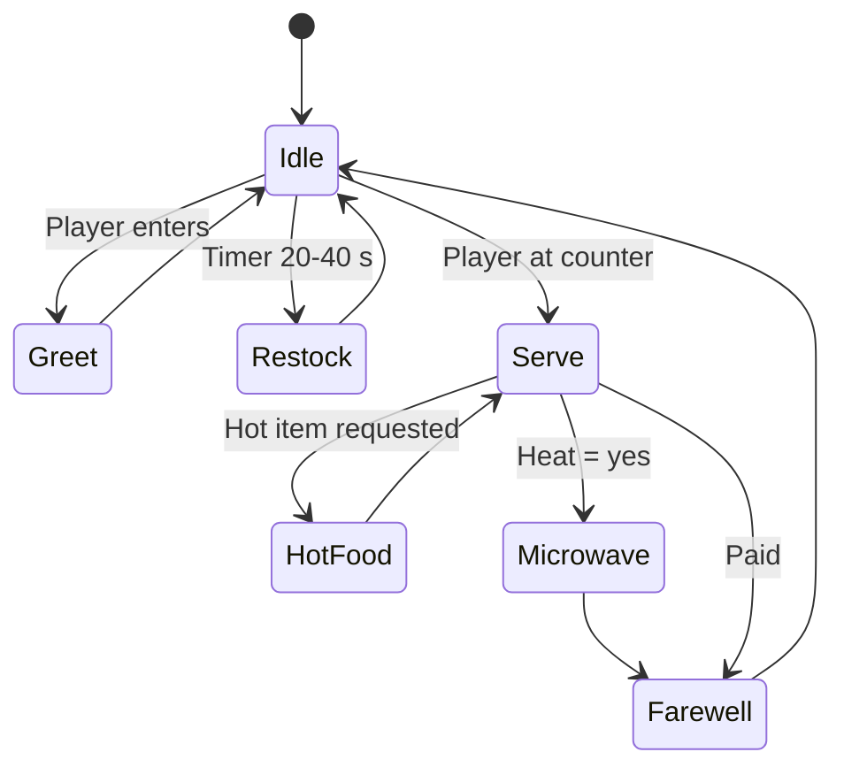
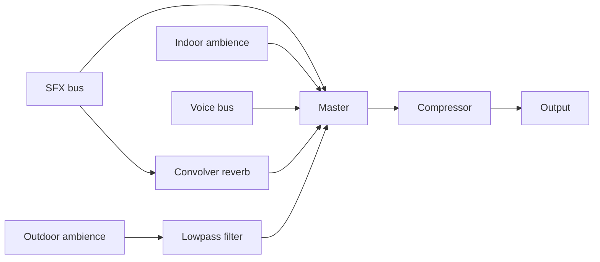

# Lawson Fuji: Konbini Game, Build Spec

Sep 23, 2026 · @Tanuj

## 1. Overview

Lawson (ローソン) is a cozy, first-person 3D browser game set in a compact Japanese town at the foot of Mt. Fuji. The player wanders the town, walks into the famous Lawson with Fuji rising behind it, shops, pays, microwaves a bento, and walks back out into the evening. It is a nostalgia piece: the goal is for someone who has been to Japan to feel it within 10 seconds, mostly through visuals, sound, and light.

**Goals**

- Ships as a static website, playable from a shared link in desktop browsers (Chrome, Edge, Firefox, Safari on macOS). Mobile and touch are not supported, so nothing is compromised for them.
- Loads in under 5-10 seconds on desktop broadband; holds a locked 60 fps at 1440p on a mid-range gaming GPU. Desktop only.
- The Lawson is the heart of the game: full loop in 2 to 4 minutes (arrive, enter, browse, basket, checkout, microwave, exit, watch Fuji), inside a compact town you can walk end to end in about 3 minutes.
- Built on a fork of Sakura Crossing (MIT), reusing its hand-painted anime look, first-person controller, train and props (section 2).
- Everything is built in code, as in Sakura Crossing: no downloaded models or images. All signage is drawn at runtime. Product labels stay generic.
- Real Japanese sounds carry the nostalgia: sound effects from 効果音ラボ and clerk lines from VOICEVOX (section 9), with generated sound as a fallback.

**Priority**

The game is about going into a konbini. Clarity, engagement and build effort go,
in this order, to:

1. Inside the store: layout, fixtures, products, light, sound and the checkout,
   accurate to a real Lawson, down to the small things you only notice by having
   been in one. This is where the nostalgia lives.
2. The store and everything around it: the facade, forecourt, parking, the road
   in front and whatever the windows look out on.
3. The town, as the walk to and from the store.

When time or budget has to be split, it goes to the higher item first.

**What is ours, and what we borrow**

The game's identity is its own: the famous Lawson under Mt. Fuji, the konbini ritual (walk in, browse, microwave, talk to the clerk, pay, walk out), and the sounds of Japan. Sakura Crossing is a starter kit, not the product. We borrow its rendering, first-person walking and street props so we can launch quickly, then repurpose them:

- Every reused building, shopfront and sign gets our own names, text and placement. No Sakura Crossing place or shop names (ひばり台, 青空商店, スーパー さかえ and so on) appear in the game.
- The town layout, the Lawson, Fuji, the store interior, the clerk, the shopping loop, the audio and all UI are ours.
- If a reused part fights the Lawson and Fuji look or the references, change it or drop it.

**Non-goals**

- Photorealism. The whole game looks like an anime film: cel-shaded, outlined, with painted skies (section 4). Detail, materials and everyday clutter should still be true to real Japan (M2e).
- Real product packaging. The store is a real Lawson (name, blue signage, milk-can logo, uniform), but every product inside is a fictional, generic item.
- Multiplayer, accounts, backend, or saving progress across devices.
- Combat, fail states, timers, or scoring pressure.

**How to use this doc with Claude Code**

Paste the kickoff prompt from section 13 into Claude Code, with this doc saved in the repo as `SPEC.md`. Build milestone by milestone (section 12) and check each acceptance list before moving on. Where this spec gives numbers (sizes, colours, frequencies), treat them as starting values to tune, not hard rules.

**Reference**

This image is the visual target for the whole game. Section 4 describes it in buildable terms. Where anything in this spec conflicts with the image, the image wins; note the difference in `DECISIONS.md`. Match the mood and technique, do not reproduce this artwork.

&#91;image: Anime dusk reference: level crossing, green train, power lines and Mt. Fuji\]

| Element | What the game must do |
| --- | --- |
| Sky | Pink, lavender and peach dusk with layered wispy clouds lit gold from below; the brightest band sits low behind Fuji |
| Fuji | Centred in the frame, hazy blue-violet body, crisp white snow cap with painted ridge lines, atmospheric fade at its base |
| Ground | Wet asphalt after rain, with mirror reflections of the sky, signals and train, plus shallow puddles |
| Power lines | Many crossing overhead wires and leaning concrete poles, dark silhouettes against the bright sky |
| Level crossing | Yellow and black striped barriers, red lights, treated as a central scene element rather than background |
| Train | Green and cream two-tone local train passing in the middle distance, passengers as silhouettes in lit windows |
| Town | Dense hillside houses with tiled roofs stepping up behind the road, trees between them |
| Foreground | Tree branches with backlit leaves framing the top of the shot; a tall lit shop sign at the frame edge |
| Characters | Small in frame, seen from behind, looking at the view; they set the sense of scale |
| Signals | Glowing green traffic lights with a soft glow |
| Colour | Warm sky against cool ground, high saturation, soft haze, no grey anywhere |

**Mood reference 2: the store by day**

&#91;image: Anime daytime reference: Lawson store, parking lot, cherry blossoms and Mt. Fuji\]

This is the target for the day phase and for the store itself. Save it in the repo as `reference/mood-day.png`. The first image sets the golden-hour mood; this one sets the store's shape and the daytime look.

| Element | What the game must do |
| --- | --- |
| Store | Low, flat-roofed single-storey box with a full-width glass front, white walls, and a horizontal blue-and-white striped band carrying the sign. Match this silhouette |
| Parking lot | Open forecourt in front with painted white bay lines and 3 to 4 parked kei cars in pastel colours (white, red, blue, green) |
| Sky | Deep saturated blue, huge white cumulus with cel-shaded grey-blue undersides, wispy high cloud |
| Fuji | Behind and to the right of the store, snow bright white with blue-shadowed ridges, soft haze at its base |
| Cherry blossoms | Clusters of pink sakura trees behind and beside the store; petals drift across the scene (spring setting) |
| Power lines | Tall poles on the right with many wires; their thin shadows fall across the asphalt |
| Light | Sun high on the right, a subtle lens flare when looking toward the sun |
| People | Small figures at the storefront and on the sidewalk, for scale and life |
| Road | Dry, sunlit asphalt with crisp shadows by day (wet look applies from golden hour onward, per the first reference) |

Season: the game is set in spring. Add 10 to 14 sakura trees (pink blob canopies, toon-shaded, no outlines at distance) and a falling-petal particle system (150 petals High, 60 Low).

**Real-world references: the hero views (the reason this game exists)**

These are photos of the real Lawson in front of Mt. Fuji. This famous view is the heart of the game, so the game must recreate both views faithfully in composition, then render them in the anime style of the two mood references above. Save them as `reference/real-day.png` and `reference/real-bluehour.png`.

&#91;image: Real Lawson storefront with Mt. Fuji above the roof, clear day\]

&#91;image: Real Lawson storefront at blue hour, pink Fuji, glowing store and a parked white kei van\]

**What makes the view (match these exactly)**

| Element | Real-world fact to recreate |
| --- | --- |
| Camera angle | Straight-on and symmetrical, from across the road at eye level (1.6 m), looking perpendicular to the storefront |
| Fuji placement | Only Fuji's upper cone shows, rising directly above the flat roof, peak slightly right of centre. The roofline cuts across Fuji's lower slopes |
| Fuji scale | Fuji looks enormous because of telephoto compression: in the hero shot its base spans about 60 to 70% of the frame width |
| Storefront | Long, low, flat-roofed box; white fascia above; blue sign band with white panels; floor-to-ceiling glass with vertical mullions; tiled wall section at the right end; shelves and posters visible through the glass |
| Forecourt | Painted white parking bays directly in front, a short zebra-striped walkway at the entrance, yellow bollard, a lone shopper at the door |
| Road and kerb | Road in the foreground; a yellow tactile-paving strip along the near kerb (blue-hour photo) |
| Day version (photo 1) | Clear cloudless blue sky, crisp white snow, bright flat daylight |
| Blue-hour version (photo 2) | Deep blue sky, Fuji lit pink-violet (alpenglow), the store glowing white-blue from inside, a white boxy kei van parked in front with headlights on |

**How to build the hero views**

- **Hero camera 1 (day) and hero camera 2 (blue hour):** fixed camera positions saved in `config.js`, across the road, centred on the storefront. Use a narrow FOV (about 30 to 35°) from about 35 to 45 m back to get the telephoto compression; Fuji's size and distance are tuned *from this camera*, so the peak sits above the roof exactly as in the photos. Then check the gameplay camera still looks good.
- **Spawn:** the game opens on hero camera 1 at golden hour (the title screen shows it), then eases down to the first-person view standing on that same spot.
- **Photo mode:** a "Famous view" button snaps to the hero camera for the current time of day. Stamp card: "Took the famous photo" (one by day, one at blue hour).
- **Blue-hour moment:** when time reaches dusk, the white kei van arrives and parks in front of the entrance with headlights on, matching photo 2; it leaves at night.
- **Anime translation:** keep the real composition but paint it: cel-shaded Fuji with pink alpenglow bands, saturated blue sky, a soft selective glow on the store and headlights, outlines on the store and van. On the day version, add the mood-reference clouds and sakura only at the frame edges so they never cover Fuji or the sign.
- **Keep clear:** nothing (poles, wires, trees, cars) may block Fuji or the sign in the hero views. Route wires to the frame edges.

## 2. Tech stack and structure

**Base project: a fork of Sakura Crossing**

The game is a fork of [Sakura Crossing](https://github.com/Kenton-GMI/sakura-crossing), an MIT-licensed Three.js project that renders a code-built Japanese neighbourhood as a hand-painted anime background, explored in first person. Its rendering pipeline, player controller and props are reused. Its many districts are stripped down to one compact town. The Lawson, Mt. Fuji, the store interior, the clerk and the whole shopping loop are new.

| Sakura Crossing part | Action |
| --- | --- |
| `src/core/` toon, post, outline, sky, palette, textures, util | Keep as the rendering foundation |
| `src/core/player.js` (first-person walk) | Keep; flatten it (see below); e-bike riding removed for now |
| `src/core/hud.js` | Keep as the base for our HUD |
| `src/core/audio.js` | Keep the playlist code; delete the bundled stock track (not MIT) |
| `src/world/` train, railway, vending, vehicles, trees, petals, streetprops, props, buildings, housing, shotengai, shops, details | Reuse as parts for the compact town |
| `src/world/` planet, landform, hills, tunnel, lake, canal and every named district (school, shrine, onsen, matsuri, the 丁目 blocks and so on) | Remove from the build; mine for parts only when needed |
| `CLAUDE.md` (184 KB) and `NEXT.md` (157 KB) | Delete from the working tree (git history keeps them). Replaced by our short `AGENTS.md` (section 13); a file that size would load every session and drain Pro usage |
| `LICENSE` | Keep. Credit Sakura Crossing in the README and the in-game credits |

**Flatten the planet first.** Sakura Crossing wraps its world round a small planet. Our town sits on a flat plane so Fuji can stand huge in the distance. Remove the spherical mapping from the world placement and from the player's spherical camera frame before anything else, since it touches every placement.

| Area | Choice |
| --- | --- |
| Rendering | Three.js, version as pinned by Sakura Crossing |
| Language | JavaScript ES modules, as Sakura Crossing (JSDoc types where helpful) |
| Build | Vite: `npm run dev`, `npm run build` to a static `dist/` |
| Assets | None downloaded. All geometry and textures built in code; all signage drawn with Canvas2D |
| Mt. Fuji | Real elevation data from Japan's GSI tiles, fetched once by a script and baked into `src/data/fuji-dem.bin` |
| Audio | Web Audio API: sound files from assets/audio/ (効果音ラボ, VOICEVOX), procedural fallbacks (section 9) |
| Input | Keyboard + mouse with pointer lock |
| UI | HTML/CSS overlay |

**Hosting:** a static site on Netlify, Cloudflare Pages or GitHub Pages. No requests to other domains at runtime. Desktop only. `localStorage` (wrapped in try/catch) for settings, receipts and stamps only.

**File structure**

```
lawson-fuji/              (fork of sakura-crossing)
  AGENTS.md               // standing rules for every agent
  CLAUDE.md               // one line: @AGENTS.md
  SPEC.md  LICENSE  README.md
  reference/              // the 4 reference images
  assets/audio/           // sound files: git-ignored, not MIT (section 9)
  scripts/
    fetch-fuji-dem.mjs    // one-time: GSI tiles -> src/data/fuji-dem.bin
  src/
    main.js
    core/                 // from Sakura Crossing
    world/
      town.js             // NEW: compact town layout, places everything
      lawson.js           // NEW: store exterior, sign, forecourt
      lawson-interior.js  // NEW: shelves, fridges, counter, microwave, coffee
      fuji.js             // NEW: DEM mesh, snow, alpenglow
      products.js         // NEW: catalog-driven product meshes
      ...                 // reused Sakura Crossing modules
    npc/clerk.js          // NEW
    game/                 // NEW: state, basket, checkout, microwave, stamps
    sfx/                  // NEW: procedural audio
    ui/                   // NEW: basket, checkout, receipt, menus
    data/                 // catalog.js, strings.js, fuji-dem.bin
```

## 3. World layout

A dense, lived-in, mixed-use town built around the famous view: a tight grid with a walkable core of about 180 m x 150 m. Units are metres, +Y is up, the Lawson's front faces +Z toward the main road, and Fuji lies behind it to the −Z side. There are no separate zones: shops, homes and small lots are interleaved along every street.

**Quality bar**

- `reference/density/` holds frames from a newer Sakura Crossing build. They set the bar for density and finish.
- Beyond density: the town must feel like a real Japanese neighbourhood, true in its materials, wear, planting and everyday clutter (M2e, `reference/japan-details.md`).
- Match their density and polish, not their designs. Never copy their names, shops, signs or train livery (桜ヶ丘, ひだまりマート, 桜川電鉄, 春風 and so on). Everything stays ours.
- Those frames come from a newer build than our fork. The station interior, ticket gates, people, bus stop, cycle lanes and shop interiors are NOT in our parts library. Build them.
- The M1 hero views must not change. Press 1, 2, 3 after every change to check.
- Build systems, not one-offs: seeded generators for lots, houses, shopfronts, the pole-and-wire network, road markings and prop scatter. Density comes from rules, not hand placement.

**Town plan: structure**

- The game opens on the famous views, and the town lies ahead: between the Lawson and Mt. Fuji, north of the main road. You walk past the store into it, toward Fuji.
- From the main road north: the Lawson's neighbours along the road, then residential lanes and a shopping spine running north to the station plaza, the station, and the railway along the far north edge with the level crossing.
- The Lawson stays on the main road facing it, with Fuji behind. Behind the store, anything inside the famous views' frame stays under the roof's sightline from the hero camera (lower near the store, three storeys by about 60 m back); poles there give way to low lamp posts (防犯灯) with no overhead lines.
- Behind the start spot, south of the road: the photographers' lot, an older residential lane, a park and fields.

**Town plan: scale**

- Residential lanes: 4 to 5 m, no sidewalk, white edge lines only.
- Shopping street: about 6 m, with a narrow pavement.
- Main road: 2 lanes (about 7 m), 2 m pavements, painted cycle lanes.
- Buildings sit 0 to 1 m from the lot edge, are 2 to 3 storeys, with 7 to 12 m frontage and 0.5 to 1.5 m gaps between them.

**Town plan: mixing**

- Shops on the ground floor with homes above; shops interleaved with houses along every street.
- One small inari shrine with a torii, lanterns and banners.
- A coin-parking lot, a small 2-floor apartment block (external steel stairs, numbered doors, AC units), a weedy vacant lot, a tiny park.

**Density budget**

- From any walkable spot, the view within 25 m contains at least: 2 detailed buildings (windows, gutters, AC units, balconies, laundry, nameplates), 1 pole with wires, 5 small props, and road markings.
- No stretch of bare wall, pavement or asphalt longer than about 8 m without something on it.

**Roads kit**

- Asphalt: 2 to 3 tone patches, crack lines, several manhole types, drain grates, side gutters (側溝) with grate lids, kerbs, tactile paving at crossings and the station.
- Markings (canvas decals, Japanese): yellow centreline on the main road, white dashed lines elsewhere, edge lines, stop lines with 止まれ, zebra crossings, ◇ crossing-ahead diamonds, 30 and 40 speed numerals, スクールゾーン, 歩行者優先, green or blue cycle lanes with bike symbols and arrows, a バス stop box.
- Sakura petals collecting along kerbs and under trees.

**Poles, wires and signs kit**

- Concrete poles every 20 to 30 m on every street: crossarms, transformers, insulators, yellow-and-black base guards, street-lamp arms.
- A continuous wire network: 4 to 8 lines along each street with sagging catenaries, service drops to every building, and spans across the street at intersections.
- Signs: blue direction signs, speed limits, 止まれ triangles, yellow school-zone diamonds, no parking, pedestrian crossing, convex mirrors at corners, 消火栓 signs, pole advertisements for fictional clinics and estate agents, house address plates, a bus-stop pole with timetable.

**Buildings**

- House generator: 2-storey siding, mortar, old tiled-roof, modern box. Variants for colour, roof and window layout. Block walls (ブロック塀) with gates, hedges, mailboxes, potted plants, bikes, AC units, gas meters, laundry poles, TV antennas.
- Shopfronts: 8 to 10 types, e.g. ramen, 喫茶, bakery, florist, 和菓子, general store, barber with a pole, laundromat, dentist, closed shutter. Each has an awning, fascia sign, noren or nobori flags, a visible interior (shelves, counter, lights) and outside clutter (A-frame board, crates, bench, planters, a vending machine).
- All names fictional and ours.

**Station and trains**

- Station building: our station name board, clock, ticket machines, fare map, staffed window, ticket gates, departure board, posters.
- Station plaza: clock pole, bus stop with shelter, taxi, bike racks full of bicycles, phone booth, area map, bins, planters, benches ringing a big sakura.
- Platforms: two, with canopies, name boards, timetable, benches, bins, platform numbers, yellow tactile lines, fences, overhead catenary gantries along the line, and a footbridge or level crossing within the station.
- Train cycle: a train arrives and stops at the platform, doors open, it waits 60 s, a door chime plays, doors close, it departs. The next train arrives about 60 s later. Alternate directions on the two tracks. The level-crossing bells and barriers are driven by the real train position.
- Train: our green-and-cream livery; lit interior with seats and a few silhouette passengers.
- Original chimes only; no real station departure melodies.

**Trees, light and life**

- Sakura: much fuller canopies (many overlapping painted clusters, dark branches visible), a few large hero trees, petal fall plus petal drifts on the ground, dappled shadows.
- Night: warm lit windows, glowing shop interiors, lit lanterns and street lamps against the cool sky. Night streets must never be one flat blue.
- Birds on wires, a cat, sparrows on the ground.
- Optional, last: a few idle people (students at the station, a shopper). Only after everything else passes.

**Rules**

- Fuji is visible from most of the town, and from the hero-view spot nothing blocks it or the store sign.
- The town edge is soft: tree lines, low hills and fences, with the painted hillside and Fuji beyond. No invisible walls in open road.
- The railway runs straight and disappears into a tree-lined cutting at each end (no planet loop).
- Keep it compact. Extra districts from Sakura Crossing are not added unless Tan asks.

**Mt. Fuji and sky**

- Fuji is built from real elevation data (GSI tiles), baked by `scripts/fetch-fuji-dem.mjs`, decimated, and placed far behind the store; its scale is tuned from the hero cameras (section 1).
- Toon-shaded in Sakura Crossing's style with painted snow above roughly 2,500 m, a jagged posterised snow line, alpenglow at golden and blue hour, and haze at its base.
- Sky, clouds and fog use Sakura Crossing's `sky.js` as the starting point, re-tuned to the mood references.

**Store exterior**

- Footprint 14 m wide x 10 m deep x 4 m tall. Flat roof with a parapet.
- Front: full-width glass with aluminium mullions, sliding automatic double door in the centre (opens when player is within 1.8 m, closes after 2 s clear).
- Signage band: 1.2 m tall lit band across the top in Lawson blue with the white "LAWSON" wordmark and the milk-can logo drawn on canvas, plus "ローソン" on the side sign; a tall roadside pole sign repeats the logo. Emissive material; flickers once on at dusk.
- Posters in the windows (canvas textures): "おにぎり 100円セール", "新発売", "ホットコーヒー".
- Outside: bin station with 3 colour-coded slots (燃える / 缶・ペット / プラ), ashtray stand, bicycle rack, a folded umbrella stand.

**Store interior (floor plan, looking in from the door)**

| Zone | Position | Contents |
| --- | --- | --- |
| Entrance mat | Just inside door | Basket stack (red plastic baskets) on the left |
| Magazine rack | Along the front glass, right side | Rows of fictional manga/magazine covers (flat colour blocks) |
| Aisle 1 | Left, front to back | Snacks, chips, sweets |
| Aisle 2 | Centre | Instant noodles, bread, melon pan |
| Aisle 3 | Right | Daily goods: tissues, umbrellas, batteries, phone cables |
| Drinks wall | Full back wall | 8 glass-door fridge bays, lit from inside, bottles and cans |
| Chilled case | Left wall, open-front | Onigiri, sandwiches, bento, salads, desserts |
| Hot case | On the counter | Karaage, nikuman steamer, oden pot (steam particles) |
| Counter | Right side, near the door | Register, card reader, microwave behind, clerk behind |
| Coffee machine | End of counter | Self-serve, cup sizes |
| Copy machine / ATM | Front left corner | Decor only, soft beep when approached |
| Restroom door | Back right | Sign "お手洗い", decor only |

Aisles are 1.4 m wide and shelves 1.6 m tall, so in first person you can see over them to the drinks wall. Ceiling at 3 m with rows of flush fluorescent panels. Floor: pale tiles with soft painted reflections.

## 4. Art direction: anime style

The whole game uses Sakura Crossing's rendering pipeline (`src/core`): toon ramps with violet-shifted shadows, ink lines from the second difference of depth, inverted-hull outlines on hero props, and a split-tone colour grade. For technique, Sakura Crossing's code wins wherever it differs from this section. For colour, mood, and everything specific to the Lawson and Fuji, this section and the reference images win. Nothing aims for photorealism; the target is a frame from a hand-painted anime background, as rich in detail and as true to real Japan as the best of them (M2e).

**From Sakura Crossing (use as is, then tune)**

- Toon materials with hand-authored gradient ramps and violet hue-shifted shadow bands (`toon.js`); the high-key ramp for pale masses such as blossom and drinks behind glass.
- Ink lines from the second difference of depth, fading with distance (`post.js`); inverted-hull outlines on hero props (`outline.js`), now also on the Lawson facade, counter, vending machines, train and clerk.
- The two-light anime setup: warm quantised sun, strong cool bounce fill, weak up-light, violet-ground hemisphere.
- Split-tone colour grade with lifted blacks; sky and clouds (`sky.js`); petals (`petals.js`); palette (`palette.js`).
- Canvas2D signage (`textures.js`) for every sign, poster, product label and price tag.

**What we add or re-tune (our identity)**

- A colour script per time of day tuned to the four reference images (table below): golden hour first, then day and blue hour.
- Mt. Fuji: the GSI mesh with 2 toon bands, a painted posterised snow line, no outline, haze at its base, pink alpenglow at golden and blue hour.
- The Lawson: blue sign band, bright white-blue interior glow spilling onto the forecourt at dusk, anime "shine" streaks on the glass.
- Wet road after rain (golden hour onward): painted reflections, i.e. a flipped, blurred gradient of the sky colours plus stretched light streaks under every bright source, and a few puddle decals. No planar reflector, to stay in Sakura Crossing's painted style and budget.
- Night glow: a small selective glow on emissive surfaces only (sign, windows, vending panels, headlights, streetlights), at dusk and night only.
- Sun: a soft halo sprite, and a subtle lens flare only when looking toward the sun by day.
- Small life: dust motes in the store light, drifting petals, stylised steam curls from bento, oden and coffee, a tiny sparkle on product pickup, emote icons (漫符) above the clerk ("!" on noticing you, "zzz" in the night yawn).
- Checkout and first-exit moments: a slight push-in and a brief letterbox.

**Colour script**

One full cycle lasts 12 real minutes by default (lockable in settings) and starts at golden hour. A single `timeOfDay` value (0 to 24) drives keyframes from a table in `config.js`: sky bands, cloud colours, shadow tint, light colours, grade, glow and ambience mix.

| Phase | Game time | Look | Store sign | Extras |
| --- | --- | --- | --- | --- |
| Morning | 06:00 to 10:00 | Pale blue, soft pastel clouds, long cool shadows | Off | Birdsong, clear Fuji |
| Day | 10:00 to 16:00 | Deep saturated blue, big white cumulus, dry road (mood ref 2, real photo 1) | Off | Cicadas loudest |
| Golden hour (start) | 16:00 to 18:00 | Lavender sky top, peach and salmon clouds, pink Fuji, wet road (mood ref 1) | Flickers on at 17:30 | Higurashi, crows |
| Blue hour | 18:00 to 19:30 | Deep blue sky, pink-violet Fuji, glowing store, kei van out front (real photo 2) | On | Streetlights on |
| Night | 19:30 to 05:00 | Indigo sky, twinkling stars, selective glow | On | Night insects, vending glow |
| Dawn | 05:00 to 06:00 | Lavender to peach, Fuji silhouette | Off at 05:45 | Mist near the ground |

**Palette anchors** (merge into Sakura Crossing's `palette.js`): Lawson blue `#0068B7` with white; store glow `#FFF3D6`; golden-hour sky `#4B3F9E` to `#FF9F6B`; day sky `#3A8DFF` to `#BFE6FF`; night sky `#141A3A` to `#3B3F7A`; Fuji body `#5169B8`, snow `#F7F8FF`; asphalt `#4A4E63`; vending glow `#D8F0FF`.

**Lights**

- Sakura Crossing's two-light setup outdoors. The sun (or moon) is the only shadow caster, with hard shadows.
- Inside the Lawson: emissive ceiling panels plus one point light; fridge interiors are emissive planes.
- Window spill: a hard-edged painted light shape on the forecourt in front of the glass, at dusk and night.

**Post-processing stack (in order)**

1. Scene render into a half-float target at 1.5 to 2x resolution (as Sakura Crossing)
2. Screen-space ink pass (Sakura Crossing's `post.js`)
3. Split-tone colour grade, re-tuned per time of day from the colour script
4. FXAA resolve

No bloom by default, as in Sakura Crossing; that is what keeps walls, sky and Fuji from washing out. If the sign, windows and headlights need a glow at dusk and night, add a small selective glow on emissive surfaces only.

## 5. Player, camera and controls

The player explores in first person with Sakura Crossing's controller (`src/core/player.js`), flattened for our town. There is no player avatar.

**Movement**

| Parameter | Value |
| --- | --- |
| Eye height | 1.6 m |
| Walk and run speeds | Sakura Crossing's values as the starting point |
| Indoors | Running disabled; walk capped at 1.4 m/s |
| Collision | Sakura Crossing's collision, extended to every new shelf, fridge, counter, car and pole |
| Head bob | Subtle, with an off switch in settings |

**Controls**

| Action | Input |
| --- | --- |
| Move | W A S D |
| Run (outdoors) | Shift |
| Look | Mouse (pointer lock; Esc to release) |
| Interact | E |
| Basket | Tab |
| Famous view (hero camera for the current time of day) | F |
| Photo mode | P |
| Ambience / music | M |
| Pause and settings | Esc |

**First-person details**

- A small dot crosshair. The interactable under it, within 2 m, gets a soft rim highlight and a label, e.g. "おにぎり を取る \[E\]".
- The red basket sits in the lower-left of the view once taken, with picked items visibly stacking inside. No hands are drawn; actions are shown by the objects moving.
- At checkout and the microwave, the view eases to frame the clerk and register, then hands control back.
- Settings: mouse sensitivity, invert-Y, field of view (default 70°).

## 6. Core gameplay loop

The loop is: arrive outside, enter to the chime, grab a basket, pick items, pay, optionally microwave, exit, and enjoy Fuji. There is no failure; the only "goal" is a gentle checklist and a receipt collection.



Player can leave at any time; items in an unpaid basket are gently put back ("持ち出しできません" toast, basket auto-returned), no penalty.

**1. Arrival (Outside)**

- Spawn on the far sidewalk across the road, facing the store, with Fuji framed above the roof. Camera starts in a slow 4 s cinematic dolly-in, then control is handed over.
- One-line hint: "Visit Lawson →" with the door highlighted.
- Vending machine is usable: pick a drink, 150 yen deducted from wallet, clunk, can drops, player holds it.

**2. Entering**

- Automatic door slides open (0.6 s) when within 1.8 m. Door chime plays once per entry (see audio).
- Clerk says "いらっしゃいませ！" (voice-like synth + subtitle bubble) and bows.
- Outdoor ambience ducks by 70% and interior hum fades in over 1 s.

**3. Shopping**

- Taking a basket is optional but recommended; without one the player can carry max 2 items (in hands).
- Interact with a product slot: product lifts off the shelf with a small arc into the basket (0.35 s tween), soft rustle/plastic sound per material type. The shelf slot shows the next unit (slots have 3 to 6 units).
- Fridge bays: first interact opens the glass door (hinge swing + seal pop sound + cold mist puff), second picks the drink. Door closes by itself after 4 s.
- Hot case items: interact requests the clerk ("からあげください"); added at checkout.
- Coffee machine: after paying for a cup, place cup, choose Hot/Iced, 20 s brewing with gurgle sound, pick up.
- Basket panel (Tab / basket icon) lists items, quantities, subtotal; items can be removed (they fly back to their slot).
- Wallet starts at ¥3,000. Checklist card (optional, top-left, collapsible): "Onigiri, a drink, something sweet, a hot snack".

**4. Checkout**

- Walk into the counter zone (1.2 m box in front of the register). The view eases to frame the clerk and register; control returns after payment.
- Clerk scans items one by one: each item floats to the scanner, beep, price appears on the customer display (green seven-segment style canvas), item goes into a plastic bag.
- Dialogue prompts (tappable choices), each with JP text and small EN subtitle:
  1. "袋はご利用ですか？" (Need a bag? ¥3) → はい / 大丈夫です
  2. If bento present: "温めますか？" (Shall I heat it?) → お願いします / 大丈夫です
  3. If hot items requested: clerk turns, tongs karaage into a paper sleeve.
  4. If ice cream + hot food: "袋は分けますか？" (Separate bags?) because this is peak konbini realism.
  5. "お箸はお付けしますか？" (Chopsticks?) if bento/noodles.
- Payment choice: Cash or IC card. Cash: coin tray animation, change counted back with coin clinks. IC card: tap on reader, the classic two-tone "pipi" sound.
- Total in yen, tax shown as 8% (food, takeaway) in the receipt breakdown.
- Receipt prints from the register (paper extrudes, printer whirr) and appears as a UI card. Receipts are saved to a "Receipt book" (localStorage, last 20).
- Clerk: "ありがとうございました！" + bow. The view dips in a small nod back.

**5. Microwave (v2, included)**

- Microwave sits on the back counter. If the player said yes to heating, the clerk places the bento inside; the player sees a 3D close-up.
- Timer counts down 30 s on the microwave's LED (can be skipped by tap after 5 s, for impatient friends). Interior light on, tray rotates, low hum.
- Ding (three-tone beep), clerk takes it out, steam particles rise from the bento lid, bag handed over.

**6. Exit and epilogue**

- Door chime again, ambience swells back. First exit triggers a one-time moment: camera slowly pans up to Fuji, HUD fades, title card "また来てね" (Come again) for 3 s.
- Outside, the player can sit on the low wall or guardrail (interact) and "eat": the item shows in hand, a small munch sound, and the view settles into a composed shot of Fuji.
- Bins: interact to throw away packaging into the correct slot (tiny satisfying clunk, no penalty for wrong slot but a gentle "違うかも" note).

**7. Around town**

The town is for wandering between visits, not a second game. Everything here is optional and gentle.

- Vending machines on the main road, the station and the shopping street: buy a drink anywhere.
- The level crossing: stand and watch the bells, lamps and barriers, then the train.
- The station platform and the park bench: sit and watch trains or Fuji.
- The shopping street: warm lit shopfronts to look into, some shuttered for the evening.
- Extra stamps: watched the train pass, bought from 3 different vending machines, sat in the park at golden hour.

**Gentle meta (no pressure)**

- Receipt book: collected receipts with date, time of day, items.
- Stamp card: 10 small achievements shown as hanko stamps, e.g. first purchase, heated a bento, bought at night, paid exact change, bought all 3 onigiri types, sat and watched Fuji at golden hour, used the vending machine, separated bins correctly, visited at dawn, took 5 photos.

## 7. Product catalog

The store stocks 30 fictional products, each built in code from the mesh recipe column, with a generic canvas-drawn label, in Sakura Crossing's style. Every product entry in `data/catalog.js` follows one shape so adding items later is data-only.

```ts
interface Product {
  id: string;            // "onigiri_salmon"
  nameJa: string;        // "鮭おにぎり"
  nameEn: string;        // "Salmon onigiri"
  priceYen: number;
  zone: "chilled" | "drinks" | "snacks" | "noodles" | "bread" | "daily" | "hot" | "frozen" | "coffee";
  mesh: MeshRecipe;      // primitive recipe: shape, size, colours, label text
  sound: "plastic" | "can" | "bottle" | "paper" | "box" | "soft";
  heatable?: boolean;    // triggers microwave question
  needsChopsticks?: boolean;
  cold?: boolean;        // triggers separate-bag question
  unitsPerSlot: number;
}
```

| Zone | Item (JA / EN) | Price (¥) | Mesh recipe | Flags |
| --- | --- | --- | --- | --- |
| Chilled | 鮭おにぎり / Salmon onigiri | 160 | Triangle prism, rice white, nori strip, pink label |  |
| Chilled | ツナマヨおにぎり / Tuna-mayo onigiri | 150 | Same, blue label |  |
| Chilled | 梅おにぎり / Umeboshi onigiri | 140 | Same, red label |  |
| Chilled | 幕の内弁当 / Makunouchi bento | 580 | Flat box, clear lid, 4 compartments of colour | heatable, chopsticks |
| Chilled | 唐揚げ弁当 / Karaage bento | 520 | Flat box, brown lumps, rice | heatable, chopsticks |
| Chilled | たまごサンド / Egg sandwich | 280 | Triangular wedge, yellow cross-section |  |
| Chilled | ポテトサラダ / Potato salad | 230 | Small cup |  |
| Chilled | プリン / Custard pudding | 200 | Truncated cone, caramel top |  |
| Drinks | 緑茶 / Green tea | 160 | 500 ml PET bottle, green label |  |
| Drinks | 麦茶 / Barley tea | 140 | PET bottle, brown label |  |
| Drinks | 缶コーヒー / Canned coffee | 130 | Short can, dark blue |  |
| Drinks | カルピス風 乳酸飲料 / Milky soda | 150 | PET bottle, white/blue dots |  |
| Drinks | ラムネ / Ramune | 180 | Codd bottle with marble |  |
| Drinks | いちご牛乳 / Strawberry milk | 170 | Paper carton, pink |  |
| Snacks | ポテトチップス / Potato chips | 160 | Puffy bag (scaled sphere + box) |  |
| Snacks | チョコ棒 / Choco sticks | 180 | Slim box |  |
| Snacks | きのこの山風 / Choco mushrooms | 230 | Small box |  |
| Snacks | グミ / Gummies | 140 | Flat pouch |  |
| Noodles | カップ麺 / Cup ramen | 220 | Cylinder cup, foil lid | chopsticks |
| Noodles | 焼きそば / Yakisoba cup | 240 | Square tray | chopsticks |
| Bread | メロンパン / Melon pan | 150 | Dome with grid texture |  |
| Bread | カレーパン / Curry bread | 170 | Oval, golden |  |
| Frozen | ソフトクリーム / Soft-serve cone (packaged) | 240 | Cone + swirl | cold |
| Frozen | かき氷アイス / Shaved-ice cup | 180 | Cup, rainbow top | cold |
| Daily | ビニール傘 / Clear umbrella | 650 | Long cylinder + cone canopy |  |
| Daily | ポケットティッシュ / Pocket tissues | 100 | Tiny flat box |  |
| Hot | からあげ / Karaage (5 pc) | 238 | Paper box, brown lumps | ask clerk |
| Hot | 肉まん / Nikuman | 180 | White dome | ask clerk |
| Hot | おでんセット / Oden set | 320 | Cup with egg, daikon, konbu | ask clerk, chopsticks |
| Coffee | ホットコーヒー / Hot coffee (R) | 120 | Paper cup + lid | brew at machine |

All names and packaging are original. Where a product evokes a real snack (e.g. choco mushrooms), the name must be generic and the look must not copy the real package.

**Label textures:** one shared 1024 x 1024 canvas atlas, 64 cells of 128 x 128, generated at boot. Each label: background colour, JP name in bold, small EN name, a simple icon (circle, fish, leaf) drawn with canvas paths. Price tags on shelf edges are separate small canvas quads (white with red price text: "¥160 (税込)").

## 8. Clerk NPC

One clerk, always polite, always busy with small tasks, driven by a finite state machine. The clerk is what makes the store feel alive.

**Look:** built in code in Sakura Crossing's style (toon ramp, ink lines), 1.65 m, stylised anime proportions from simple shapes: Lawson-style blue and white striped shirt, name badge ("やまだ"), short dark hair, and a simple painted face with canvas-drawn eyes that blink. Animation is procedural (bow, scan, reach, turn, walk) with eased keyframes. This is the only character in the game, so it gets extra care: it should read as a figure from a painted anime background, never as a robot.



| State | Behaviour | Animation | Voice line |
| --- | --- | --- | --- |
| Idle | Stands behind counter, occasionally tidies register or checks hot case | Breathing, hand-on-counter, look toward door | None |
| Greet | Faces door, bows 30° for 0.8 s | Bow | いらっしゃいませ！ |
| Restock | Only when player is inside and not at counter; walks to a nearby shelf via 3 waypoints, crouches, returns | Walk, crouch, place | 失礼します (if player blocks path) |
| Serve | Returns to register (teleport-free, walks), scans items | Reach, scan, bag | お預かりします, prompts from section 6 |
| HotFood | Turns to hot case, tongs item into sleeve | Turn, reach, tong | かしこまりました |
| Microwave | Turns, places bento, waits, removes | Turn, wait, lift | 少々お待ちください |
| Farewell | Hands bag, bows | Bow | ありがとうございました！ |

**Rules**

- If the player approaches the counter while the clerk is restocking, the clerk says "少々お待ちください" and walks back (max 3 s).
- Clerk head tracks the player (clamped ±60° yaw) whenever within 4 m and in Idle.
- Night time variant: slight yawn animation once per night phase. A tiny human touch.
- Speech bubbles: rounded white bubble above the head, JP text large, EN subtitle small below, 2.5 s. Bubble always faces the camera (sprite).

## 9. Audio design

Sound is the heart of the nostalgia, so audio gets as much care as visuals. Real recordings come first: sound effects from 効果音ラボ (Sound Effect Lab, soundeffect-lab.info) and clerk voice lines from VOICEVOX, following the audio list below. The procedural recipes further down remain as fallbacks, so the game still runs when a file is missing, for example from a fresh clone of the public repo.

**Audio graph**



The outdoor bus lowpass drops from 20 kHz to 900 Hz and gains down 70% when the player is inside; reverse when outside. The reverb impulse response is generated in code (decaying noise, 0.8 s indoor). Positional sounds (vending machine hum, crossing bell, microwave) use `PannerNode` with HRTF.

**Local sounds (town-wide rule).** Every sound or interactive cue that belongs to a place is heard only as the player nears that place, never across town: full volume within a short `near` range, eased to silence at `far`, and not playing at all beyond it (ranges in `config.js` `SOUND`). The crossing bells, for example, carry to the station plaza's south edge and the platforms, not to the Lawson. Only the ambience beds (birds, wind, night insects) and the in-store music are heard everywhere they apply.

**Audio list (Tan downloads, Claude Code wires in)**

Tan listens and picks each sound on 効果音ラボ using the search terms below, then saves it into `assets/audio/` under the given file name. Choosing by ear is the point: pick the version that feels most like Japan. Claude Code loads whatever exists and falls back to the procedural recipe for anything missing.

| Sound | Where it plays | Search on 効果音ラボ | Save as |
| --- | --- | --- | --- |
| Store door chime | Entering and leaving the Lawson | 入店音, チャイム | `door-chime.mp3` |
| Automatic door | Door opening and closing | 自動ドア | `auto-door.mp3` |
| Register scan beep | Each item scanned | レジ, バーコード | `scan-beep.mp3` |
| Cash drawer | Paying cash | レジ | `register-drawer.mp3` |
| IC card "pipi" | Paying by card | 電子マネー, 決済音 | `ic-card.mp3` |
| Coins | Change counted back | 小銭, コイン | `coins.mp3` |
| Receipt printer | Receipt printing | レシート, プリンター | `receipt.mp3` |
| Plastic bag | Bagging items | レジ袋, ビニール袋 | `bag.mp3` |
| Picking up packaging | Onigiri, snacks, bento | ビニール, パッケージ | `pickup-plastic.mp3` |
| Picking up a can / bottle | Drinks | 缶, ペットボトル | `pickup-can.mp3`, `pickup-bottle.mp3` |
| Fridge door | Drinks wall | 冷蔵庫 | `fridge-door.mp3` |
| Microwave running and ding | Heating the bento | 電子レンジ | `microwave-run.mp3`, `microwave-ding.mp3` |
| Coffee machine | Self-serve coffee | コーヒーメーカー | `coffee.mp3` |
| Vending machine | Buying a drink outside | 自動販売機, 自販機 | `vending.mp3` |
| Level crossing bells | Before and during each train | 踏切 | `crossing-bells.mp3` (loopable) |
| Train passing | Every \~3 min | 電車, 通過 | `train-pass.mp3` |
| Station ambience | Station platform | 駅, ホーム | `station-amb.mp3` |
| Crosswalk signal chirp | Green light | 信号, 横断歩道 | `crosswalk.mp3` |
| Car passing | Occasional traffic | 車, 通過 | `car-pass.mp3` |
| Footsteps outdoors / on tile | Walking | 足音 | `steps-out.mp3`, `steps-in.mp3` |
| Cicadas (day) | Day, golden hour | セミ, ミンミンゼミ | `cicadas.mp3` (loop) |
| Evening cicadas (ヒグラシ) | Dusk | ヒグラシ | `higurashi.mp3` (loop) |
| Night insects | Night | 鈴虫, コオロギ | `night-insects.mp3` (loop) |
| Crows | Dusk | カラス | `crows.mp3` |
| Morning birds | Morning | スズメ, 小鳥 | `birds.mp3` |
| Wind | Always, quiet | 風 | `wind.mp3` (loop) |
| Town ambience | Outdoors, low | 街, 環境音 | `town-amb.mp3` (loop) |
| UI tap | Menu buttons | ボタン, 決定 | `ui-tap.mp3` |
| Stamp | Earning a stamp | ハンコ, 判子 | `stamp.mp3` |

The store hum, fluorescent buzz and fridge compressor stay procedural; they are quiet beds that the recipes below already cover.

**In-store music:** `assets/audio/store-bgm.mp3` loops only while the player
is inside the Lawson. It fades in over 1.5 s on entering and out over 1.5 s
on leaving, and ducks under voice lines. Use Sakura Crossing's `audio.js`
playback as the base. Like every file in `assets/audio/`, it is never
committed; its source and any credit it needs go in the README.

**Licence rules for 効果音ラボ sounds**

- Free for any use, including commercial; a credit is optional, but the game credits the site anyway.
- **No redistribution, including edited files.** `assets/audio/` is git-ignored and never committed to the public repo. The README states that audio files are not covered by the MIT licence and lists how to get them.
- **No soundboard.** Sounds only play from gameplay. No sound test, sound gallery, or free-play menu, since content where the sounds themselves are the point counts as redistribution under the site's terms.
- **No hotlinking.** Files are served from our own site, never linked from theirs.
- No real store chain jingles or station departure melodies from any source; the door chime must be a generic chime.
- Trimming, fading and setting loop points is fine.

**Clerk voice (VOICEVOX)**

The clerk's lines are generated with VOICEVOX (free Japanese text-to-speech) using one calm, polite voice, then exported as files: `voice-irasshaimase.mp3`, `voice-fukuro.mp3` (袋はご利用ですか), `voice-atatame.mp3` (温めますか), `voice-ohashi.mp3` (お箸はお付けしますか), `voice-shoushou.mp3` (少々お待ちください), `voice-arigatou.mp3` (ありがとうございました), `voice-shitsurei.mp3` (失礼します). Credit the voice as its character's terms require (usually "VOICEVOX:\<character name>"); check them before choosing a voice.

**Procedural fallbacks (used when a file is missing)**

| Sound | Trigger | Recipe (starting point) |
| --- | --- | --- |
| Door chime | Door opens | Original 6-note phrase on a soft electric-piano voice: sine + 2x harmonic at 0.3 gain, fast attack, 1.2 s exp decay. Notes (suggested): E5, C#5, A4, B4, E5, A5 at 0.28 s spacing, light reverb |
| Automatic door | Open/close | Filtered pink noise sweep 0.6 s + low 60 Hz motor hum |
| Register scan | Each item | Square wave 2,700 Hz, 70 ms, quick decay |
| IC card tap | Payment | Two sines 2,000 Hz then 2,600 Hz, 60 ms each, 20 ms gap |
| Coin clink | Cash, change | 3 to 5 short metallic hits: inharmonic sines (1,800 / 4,100 / 6,300 Hz), randomised pitch ±8% |
| Receipt printer | Printing | Bandpassed noise at 3 kHz amplitude-modulated at 40 Hz, 1.4 s |
| Microwave hum | Heating | 120 Hz sawtooth through lowpass 400 Hz + gentle 0.5 Hz wobble |
| Microwave ding | Done | Three 1,000 Hz square beeps, 150 ms on / 100 ms off |
| Fridge door | Open/close | Low thump (80 Hz sine 50 ms) + rubbery seal pop (noise burst, bandpass 1.2 kHz) |
| Product pickup | Per material | plastic: crinkly high noise bursts; can: short 900 Hz ping; bottle: hollow 300 Hz knock; paper: soft brown-noise swish |
| Vending machine | Buy | Button beep, 1 s motor whir, heavy clunk (60 Hz sine + noise, 120 ms) |
| Coffee machine | Brewing | Gurgle: random low noise bursts through resonant filter, 20 s |
| Crosswalk bird | Signal green | Original two-tone chirp: sine glide 2,800 to 3,600 Hz, 80 ms, repeated in "pi-yo" pairs every 0.6 s |
| Railway crossing | Before each train | Alternating two bell tones (\~730 Hz and \~860 Hz, FM bell voice) at \~2 Hz while the crossing is closed, positional, heard only near the crossing and station (`SOUND.crossingBells`) |
| Footsteps | Walking | Short filtered noise clicks; outdoor = lower, grittier; indoor tile = brighter with slight reverb |
| UI tap | Buttons | 1,200 Hz sine 30 ms |
| Stamp earned | Achievement | Soft wooden "tok" (triangle 400 Hz, 40 ms) + chime note |

**Ambience loops**

| Loop | When | Recipe |
| --- | --- | --- |
| Cicadas (ミンミンゼミ feel) | Day, golden hour | Several oscillators \~4 to 6 kHz with fast AM (15 to 30 Hz) and slow swells; 3 layers panned |
| Crickets | Night | Short 4.5 kHz chirp trains, random intervals |
| Crows | Dusk | Occasional harsh "kaa": sawtooth 700 Hz with formant bandpass, pitch drop |
| Wind | Always, low | Pink noise, lowpass 500 Hz, slow gain LFO |
| Birdsong | Morning | Random sine chirps 3 to 5 kHz with pitch glides |
| Store hum | Inside | 60 Hz + 120 Hz sines, very quiet, plus fluorescent buzz (2 kHz faint) |
| Fridge compressor | Inside, near drinks wall | Positional low rumble, cycles on/off every 40 s |
| In-store music | Inside | Original, generated lo-fi loop: soft Rhodes chords (Imaj7, IVmaj7, iii7, vi7), 84 bpm, brushed noise hi-hat, very low volume. Optional toggle |
| Distant traffic | Outside | Occasional filtered car pass-by (noise, doppler via playbackRate glide) |

**Voice lines**

Voice lines come from the VOICEVOX files above. If a file is missing, fall back to the Web Speech API (`speechSynthesis`) with a `ja-JP` voice when available, then to a formant "murmur" synth matching the line's mora count. Subtitles always show.

**Mix levels (master = 1.0)**

SFX 0.8, voice 0.9, outdoor ambience 0.5, indoor ambience 0.35, music 0.2. Settings expose Master, Music, Ambience, SFX sliders.

## 10. UI and HUD

The UI is minimal, soft, and bilingual: Japanese first, small English underneath. HTML/CSS overlay above the canvas, rounded cards, white at 92% opacity with a subtle blur, Lawson-blue accents.

**Screens**

| Screen | Contents |
| --- | --- |
| Loading | Lawson logo drawn in CSS/canvas, a small onigiri spinner, progress bar while geometry and textures build |
| Title | Fuji dusk scene rendering behind; "ローソン 富士山" + "Lawson Fuji"; "クリックしてはじめる / Click to enter" (unlocks audio); settings |
| HUD | Wallet (top-left, "¥2,450"), in-game clock with phase icon (top-centre), basket count badge + photo + pause icons (top-right), interact prompt (bottom-centre), optional checklist card |
| Basket panel | Slide-in from right: item rows with JA/EN name, qty, price, remove button, subtotal |
| Checkout dialogue | Bottom sheet with clerk line (JA big, EN small) and 2 choice buttons |
| Customer display | In-world canvas texture on the register (green seven-segment style digits) |
| Receipt | Card that slides up: store name, address line ("山梨県 富士河口湖町 風の丘 1-2-3", fictional), date/time, item lines, subtotal, tax 8%, total, paid, change, barcode drawn with random bars, "またのご来店をお待ちしております" |
| Receipt book | Grid of saved receipts, tap to expand |
| Stamp card | Paper-card look with 10 hanko circles, red ink stamp animation when earned |
| Pause / settings | Volume sliders, graphics quality (Ultra / High), time speed (Normal / Slow / Locked at golden hour), in-store music on/off, subtitles language (JA+EN / EN only), controls reference, reset progress |
| Photo mode | HUD hidden, small shutter button, filters: None / Film / Evening; saves via `canvas.toBlob` + share sheet (`navigator.share` where supported, else a PNG download) |

**Typography**

Font stack: `"Hiragino Sans", "Hiragino Kaku Gothic ProN", "Noto Sans JP", "Yu Gothic", "Meiryo", system-ui, sans-serif`. JP text 18 to 22 px, EN subtitles 12 to 13 px. Minimum tap target 44 x 44 px.

**Toasts and hints**

Short, bottom-centre, auto-dismiss 2.5 s: "おにぎりをカゴに入れました" (Added onigiri to basket), "お金が足りません" (Not enough money), "スタンプをもらいました！" (Stamp earned). First-time tutorial hints appear once each and are stored as seen.

**Strings**

All text lives in `data/strings.js` as `{ ja, en }` pairs. No hard-coded UI text elsewhere.

## 11. Performance (desktop only)

The game targets desktop browsers only, so quality comes first: every visual feature in this spec is on by default, and the budgets exist to protect a locked 60 fps, not to cut features. There are only two tiers, Ultra and High; any feature marked "High only" or "High quality" elsewhere in this spec is on in both.

| Setting | Ultra (default) | High (fallback) |
| --- | --- | --- |
| Target | 60 fps at 1440p, RTX 3060 / Apple M1 Pro class | 60 fps at 1080p, GTX 1660 / Apple M1 class |
| Render scale | 2x, then FXAA (as Sakura Crossing) | 1.5x, then FXAA |
| Shadow map | 4096, hard edges | 2048, hard edges |
| Ink pass and outlines | On | On |
| Night glow (emissive only) | Full resolution | Half resolution |
| Painted wet-road reflections | On | On |
| Particles (steam, dust, petals) | 400 | 250 |
| Draw calls | < 300 | < 200 |
| Triangles | < 1M | < 600k |

**Techniques**

- `InstancedMesh` for every repeated product, with an instanced outline hull per product type. Hide a picked unit by scaling its instance matrix to 0.
- Merge static geometry per material with `BufferGeometryUtils.mergeGeometries`; freeze matrices on static objects.
- Town: instance every repeated prop (poles, signs, bikes, AC units, planters), merge static town geometry per material, and use distance-based detail for far buildings.
- Auto quality: only ever steps Ultra → High, if average frame time is above 17 ms over 5 s. Never lower. Manual override in settings.
- No allocations in the render loop; dispose geometries and textures properly; pause rendering and suspend audio when the tab is hidden.

**Desktop specifics**

- Minimum window 1280 x 720. Ultrawide supported; hero shots letterbox so the Fuji composition never changes.
- Pointer lock for camera look, with mouse sensitivity and invert-Y in settings.
- If a touch-only device opens the link, show a friendly screen: "デスクトップで遊んでね / Best played on a desktop browser". No mobile fallback.
- Test on: Chrome, Edge, Firefox (Windows), Chrome and Safari (macOS).

## 12. Build milestones

Build in 8 milestones (M2 in six parts, M2a to M2f), starting from the Sakura Crossing fork and proving the famous view before anything else. Each ends with a playable build checked against its acceptance list.

| # | Milestone | Scope |
| --- | --- | --- |
| M0 | Fork and strip | Fork Sakura Crossing, remove its CLAUDE.md, NEXT.md and stock track, flatten the planet, remove every placed Sakura Crossing district, building and prop, keeping their modules as a parts library only. Result: an empty flat world with the sky, spawning at the hero-view spot |
| M1 | Look-dev: the hero view | Lawson exterior and forecourt, GSI Fuji, sky re-tune; hero cameras for day, golden hour and blue hour; reference overlay. Tan signs off before M2 |
| M2a | Town kit | Roads and markings, poles and wires, signs, plus the screenshot script (`scripts/shots.mjs`) |
| M2b | Town | New town plan (section 3), house and shopfront generators, dressing; colliders |
| M2c | Station and trains | Station building and plaza, two platforms, train cycle, level crossing driven by the train |
| M2d | Town polish | Trees, petals, clutter pass, night lighting, performance |
| M2e | Art fidelity (and the town moved ahead of the start, M2e.3) | A researched catalogue of real Japanese street detail; painted Canvas2D textures and alpha-card foliage; sakura rebuilt as painted canopies; green trees and planting; facade, roof, window and weathering detail; shopfront interiors; ground and kerb detail. Judged close up against the reference frames |
| M2f | Minimap | A round minimap in the bottom-right corner with a compass, the player's arrow and the town's places; a full map on a key |
| M3 | Store interior + products | Automatic door, interior fixtures, 30 products, targeting and pickup, basket |
| M4 | Audio | Audio engine, all SFX, ambience loops, inside/outside mix, door chime, footsteps |
| M5 | Clerk + checkout | Clerk look, state machine and animations; greeting, scanning, dialogue choices, payment, receipt, voice lines and subtitles |
| M6 | Extras | Microwave, hot food, coffee machine, day/night cycle, blue-hour van, sit-and-eat, bins, around-town stamps |
| M7 | Polish + ship | Title screen, stamps, receipt book, photo mode, settings, credits, tutorials, performance pass, deploy |

**Acceptance criteria**

M0

- [ ] `npm run dev` runs; the ground is flat and the horizon straight.
- [ ] Nothing from Sakura Crossing is placed in the world: no districts, buildings, crossing, train or props. Only the empty ground and sky.
- [ ] No Sakura Crossing opening view, hint text, name boards or town names anywhere in the UI.
- [ ] The player spawns at the hero-view spot, facing where the Lawson and Fuji will stand.
- [ ] The rendering pipeline is still wired in (toon materials, ink pass, colour grade), ready for M1.
- [ ] `CLAUDE.md` is one line (`@AGENTS.md`), `NEXT.md` and the stock track are gone, `LICENSE` is kept.

M1 (Tan signs off before M2 starts)

- [ ] Hero cameras for day, golden hour and blue hour on keys 1, 2, 3.
- [ ] Dev-only reference overlay: key R shows the matching reference image at 50% opacity.
- [ ] Composition matches the real photos: straight-on storefront, Fuji's upper cone above the roof, peak right of centre, nothing blocking Fuji or the sign.
- [ ] Fuji is built from the GSI elevation data, in the same toon and ink style as the town.
- [ ] Nothing is washed out: sky, walls and Fuji keep their colour.
- [ ] Screenshots of all three views saved to `reference/lookdev/`.

M2 (six sub-milestones; Tan signs off each before the next starts)

**Working method**

- Plan mode first for each sub-milestone; wait for Tan's OK. Commit after each sub-milestone.
- Render-check loop (mandatory): `scripts/shots.mjs` (Playwright, headless Chromium) runs the dev build, visits a fixed list of named camera spots from `config.js`, sets the time of day, and saves PNGs to `screenshots/<date>/`. After every meaningful change: run it, look at each image next to the matching reference frame, list what is still weaker, fix it, and repeat. Never report a sub-milestone done without having looked at its screenshots.
- Each sub-milestone ends with screenshots from the fixed spots and a short written comparison against `reference/density/`.

**Every sub-milestone**

- [ ] The M1 hero views (keys 1, 2, 3) are unchanged.
- [ ] Screenshots from every fixed spot were taken, looked at, and compared in writing against `reference/density/`.
- [ ] No Sakura Crossing place, shop or line names, signs or livery anywhere; all names are fictional and ours.
- [ ] 60 fps at 1440p.

M2a

- [ ] `scripts/shots.mjs` runs headless and writes one PNG per named spot and time of day to `screenshots/<date>/`.
- [ ] Roads kit, markings, poles and wires and signs kit (section 3) exist as seeded generators, shown on a test street.

M2b

- [ ] The town follows the section 3 plan and scale: station, plaza, shopping spine, main road, residential lanes, railway on one edge, the Lawson on the open edge facing Fuji.
- [ ] The density budget passes from every fixed spot: within 25 m, 2 detailed buildings, 1 pole with wires, 5 small props, road markings; no bare stretch over about 8 m.
- [ ] Shrine, coin parking, apartment block, vacant lot and tiny park are in.
- [ ] Fuji is visible from most of the town. Nothing can be walked through, and there are no invisible walls on open road.

M2c

- [ ] Station building, plaza and two platforms are dressed as in section 3.
- [ ] The train cycle runs: arrive, doors open, 60 s wait, chime, doors close, depart; next train about 60 s later, alternating tracks.
- [ ] Level-crossing bells, lamps and barriers follow the real train position.

M2d

- [ ] Fuller sakura with petal fall and drifts; night streets with warm windows, lit shops, lanterns and lamps, never one flat blue.
- [ ] Birds on wires, a cat, sparrows.
- [ ] 60 fps at 1440p with the whole town loaded.

M2e

The bar: someone who knows Japan walks these streets and recognises them. Real in
detail and in how things are made, worn and used; still painted in the anime style
of section 4 (the best hand-painted backgrounds, not photorealism).

Order of work follows the priority in section 1: the Lawson's surroundings first
(the facade, the forecourt and parking, the road in front, the view from the store
windows, the approach streets), then outward into the town.

- [ ] Detail catalogue `reference/japan-details.md`: researched from real Japanese
      streets (street furniture, building materials, signage conventions, colours,
      how things age and are repaired), each item noting where the town uses it.
      Research only: no downloaded images are committed or used in the game.
- [ ] Sakura: painted blossom clusters (Canvas2D textures on alpha cards) over a
      branch skeleton with visible limbs and fine twigs; soft pale-top to deep-underside
      gradient; a lacy edge with sky showing through; petal carpets along kerbs, in
      gutters and under trees. Side-by-side with the reference at 3 m, 10 m and 30 m.
- [ ] Green: street and garden trees (pine, maple, camphor), clipped shrubs,
      hedges, potted plants crowding doorsteps, weeds in cracks and the vacant lot,
      creepers on some walls.
- [ ] Buildings: every house and shop type gets painted surfaces (siding boards,
      mortar with stains, roof tiles, sheet metal), window detail (frames, grilles,
      curtains, blinds, frosted glass, things on sills), gutters and downpipes, rain
      streaks and grime gradients, and visible age differences between buildings.
- [ ] Shopfronts: interiors readable from the street (stock, menus, posters,
      counters, lights), noren and nobori, shutters with wear, hand-written signs.
- [ ] Ground: asphalt texture and tone variation, patched repairs, worn paint,
      kerb stones, grated gutters, weeds, stains, fallen leaves and petals.
- [ ] Close up: at 1.5 m from any surface the player can reach, nothing reads as a
      flat untextured box.
- [ ] Review: for every fixed spot, a written side-by-side with its reference frame
      listing named details present and missing. A spot does not pass while it lacks
      something its reference shows prominently. Counts alone never pass a spot.
- [ ] 60 fps at 1440p (frame-time headroom may be spent on detail); SPEC 11 draw
      budgets reported.

M2f

- [ ] A round minimap in the bottom-right corner: the town drawn from the game's own data, rotating with the player, a compass rose with 北 at north, the player's arrow at the centre.
- [ ] Place icons from config.js PLACES (station, shrine, plaza, parks, shopping street, the Lawson); the Lawson always marked, even off the edge.
- [ ] A full-map view on a key (M), with place names in Japanese and English; UI text in strings.js.
- [ ] Hidden in the famous views' hero cameras and never drawn over the store or Fuji; desktop only; no measurable frame-time cost.

M3

- [ ] Research first: `reference/konbini-details.md` records how a real Lawson
      interior is laid out and furnished (fixtures, shelf edges and price rails,
      POP cards, fridge doors, counter items, ceiling, floor, light, sounds), and
      where each item goes in ours. Research only; no downloaded images.
- [ ] Held to the M2e bar: at arm's length nothing reads as a flat untextured
      box, and every fixed interior spot is compared in writing, detail by detail,
      with real Lawson interiors.
- [ ] The door opens and closes by proximity.
- [ ] All 30 products render with readable Japanese labels and shelf price tags.
- [ ] Picking an item moves it into the basket in view; removing it returns it to its slot.

M4

- [ ] The door chime plays exactly once per entry and per exit.
- [ ] Stepping inside audibly muffles the outdoors within 1 s.
- [ ] Audio starts after the first click in every supported browser.

M5

- [ ] Full checkout works with cash (correct change) and IC card.
- [ ] Bag, heat, chopsticks and separate-bag questions appear only when relevant.
- [ ] Receipt math is correct: item sum, 8% tax shown as included, change.
- [ ] The clerk greets, bows and reads as an anime figure, not a robot.

M6

- [ ] The microwave sequence plays end to end and can be skipped after 5 s.
- [ ] A full day/night cycle transitions smoothly, with the right sounds per phase.
- [ ] At blue hour the white kei van parks out front, matching the real blue-hour photo.

M7

- [ ] Locked 60 fps at 1440p on the Ultra tier.
- [ ] Credits list Sakura Crossing (MIT) and GSI elevation data.
- [ ] A first-time player completes a purchase within 3 minutes using only in-game hints.
- [ ] No copied melodies or real product packaging; Lawson branding only on the store, signs, uniform, receipt and bags.

## 13. Kickoff prompt for Claude Code

**Setup (Tan, once)**

1. Fork or clone https://github.com/Kenton-GMI/sakura-crossing into a folder named `lawson-fuji`.
2. Export this doc as Markdown and save it there as `SPEC.md`.
3. Save the four reference images in `reference/` as `mood.png`, `mood-day.png`, `real-day.png` and `real-bluehour.png`.
4. Create `AGENTS.md` from the block below. Replace the contents of `CLAUDE.md` with the single line `@AGENTS.md`.
5. Open Claude Code in the folder and paste the kickoff prompt. One milestone per session; `/clear` between them.

**AGENTS.md**

```markdown
# Lawson Fuji: agent rules

First-person, anime-style browser game: a compact Japanese town at the foot
of Mt. Fuji built around the famous Lawson. The player walks in, shops, pays,
microwaves a bento and leaves. Full design: SPEC.md. Read only the sections
the current milestone needs.

## Base
- Fork of Sakura Crossing (MIT). Keep LICENSE and credit it in the game.
- Reuse src/core (toon, post, outline, sky, palette, textures, player, hud)
  for all rendering. Its technique wins over SPEC.md; SPEC.md and reference/
  win on colour, mood and anything specific to the Lawson and Fuji.
- The world is flat. Never reintroduce the planet or spherical placement.
- Sakura Crossing's world modules are a parts library. Place nothing from
  them unless the current milestone in SPEC.md says so, and always in our
  layout with our own signs. The first thing players see is ours.

## Hard rules
- Desktop only. No touch or mobile fallbacks. Never lower visual quality
  for weak devices.
- Visuals are built in code: no downloaded models or images. Signage is
  drawn with Canvas2D.
- Sound files live in assets/audio/ (SPEC section 9 audio list). Never
  commit them; never add a soundboard or sound gallery; fall back to the
  procedural recipes when a file is missing. No chain jingles or station
  departure melodies.
- Lawson branding only on the store, signs, uniform, receipt and bags.
  Products and packaging are generic and fictional.
- No requests to other domains at runtime. Fuji elevation is baked by
  scripts/fetch-fuji-dem.mjs.
- No bloom by default.
- Repurpose, don't copy: reused Sakura Crossing buildings get our own
  names, signage and placement. No Sakura Crossing place or shop names
  in the game.
- UI text in src/data/strings.js, products in src/data/catalog.js,
  tunables in src/config.js.

## Reference images
- reference/real-day.png, reference/real-bluehour.png: exact hero-view
  composition.
- reference/mood.png, reference/mood-day.png: colour and mood.

## Workflow
- One milestone per session (SPEC section 12). Propose a short plan, wait
  for OK, implement, then check every acceptance item and report pass/fail.
- Log judgement calls in DECISIONS.md.
- Keep this file under 80 lines.

## Commands
- npm install
- npm run dev     (dev server)
- npm run build   (static dist/)
```

**Kickoff prompt**

```text
You are working on "Lawson Fuji", a fork of Sakura Crossing. Read AGENTS.md,
then SPEC.md sections 1, 2, 3 and 12.

Start with M0 only:
1. Propose a short plan for M0 and wait for my OK.
2. Delete NEXT.md and the stock audio track in public/audio/.
3. Flatten the planet. Remove every placed Sakura Crossing district,
   building and prop, including the crossing and train; keep their modules
   as a parts library only. The world is an empty flat plane with the sky,
   spawning at the hero-view spot (SPEC section 1).
4. Check every M0 acceptance item and mark each pass or fail.
5. Tell me how to run it and what to look at.
```

**Follow-up prompt per milestone**

```text
M<N> is next. Re-read sections relevant to M<N> in SPEC.md, propose a short
plan, then implement it. Finish by running the build and checking every M<N>
acceptance item, and list anything you deferred.
```

**Sharing with friends**

Deploy the `dist/` folder to any static host (Netlify Drop, Cloudflare Pages, or GitHub Pages) and share the link. It is too large for a claude.ai artifact.
